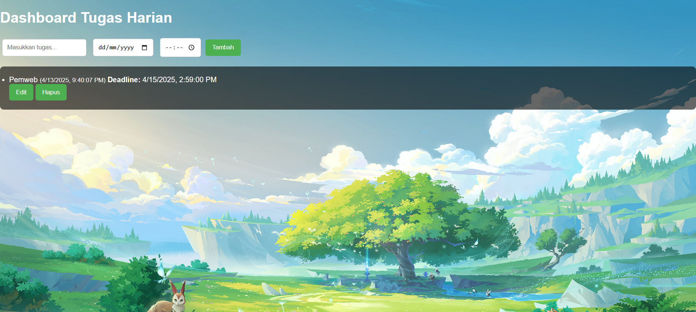

# Dashboard untuk Tugas - Tugas Praktikum Pemrograman Web Materi NextGenJS

Halo, ini adalah Tugas Praktikum Pemrograman Web saya, yaitu sebuah Dashboard Tugas Harian
Alasan saya membuat inadalah karena saya suka kesulitan memantau deadline tugas, jadi sering mepet waktu  

##  Fitur-Fitur yang ada
- Menambahkan tugas + deadline (tanggal dan jam)
- Edit tugas
- Hapus tugas
- Data tersimpan otomatis dengan `localStorage`
- Latar belakang bisa dikustom dengan gambar

##  Fitur ES6+ yang digunakan
  - `let` & `const`, untuk deklarasi variabel
  - Arrow functions (`=>`), untuk membuat fungsi dengan sintaks lebih ringkas
  - Template literals, untuk membuat string dinamis dan multiline dengan mudah
  - Async/await, untuk membuat waktu/deadline
  - Class (`TaskManager`), untuk mengatur daftar tugas

##  Bahasa yang digunakan
  - HTML, CSS, JavaScript

## Tampilan

## Cara Menjalankan 
1. Buka file `index.html` menggunakan browser.
2. Tambahkan tugas melalui form.
3. Data akan tersimpan otomatis di browser.

