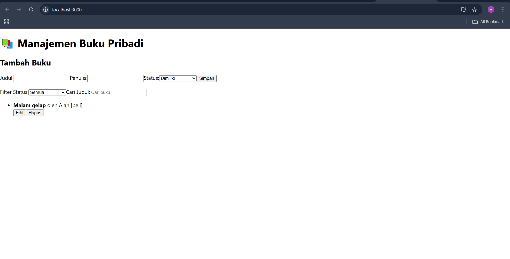

# Aplikasi Manajemen Buku Pribadi

Aplikasi ini dibuat untuk membantu pengguna mencatat dan mengelola daftar buku yang mereka miliki, sedang dibaca, atau ingin dibeli. Dibangun dengan React JS menggunakan konsep state management modern, routing, dan penyimpanan data lokal. Dibuat oleh Abyan King Al Baihaqy NIM 122140063 Pemrograman Web RA

---

## Fitur Utama

- Tambah buku baru (judul, penulis, dan status: **Dimiliki / Sedang Dibaca / Ingin Dibeli**)
- Edit dan hapus data buku
- Filter buku berdasarkan status
- Pencarian buku berdasarkan judul
- Penyimpanan data dengan `localStorage` agar tetap tersimpan saat refresh
- Navigasi antar halaman menggunakan `React Router`
- Statistik jumlah buku berdasarkan status

---

## Teknologi & Konsep

- React JS (Functional Components & Hooks)
- `useState`, `useEffect` untuk manajemen data lokal
- **Context API** untuk global state management
- **React Router** untuk navigasi antar halaman
- Custom Hooks: `useLocalStorage`, `useBookStats`
- `PropTypes` untuk validasi props
- **React Testing Library** untuk unit testing
- Error handling pada form input (validasi input kosong)
- Desain komponen yang reusable

---

## Struktur Folder

src/
├── components/
│   ├── BookForm/       # Komponen untuk menambah dan mengedit buku
│   ├── BookList/       # Komponen untuk menampilkan daftar buku
│   └── BookFilter/     # Komponen untuk filter dan pencarian buku
├── pages/
│   ├── Home/           # Halaman utama untuk menampilkan form dan daftar buku
│   └── Stats/          # Halaman untuk menampilkan statistik buku
├── hooks/
│   ├── useLocalStorage.js  # Custom hook untuk menyimpan data ke localStorage
│   └── useBookStats.js     # Custom hook untuk statistik buku
├── context/
│   └── BookContext.js     # Context API untuk state management
└── App.js               # File utama aplikasi


---

## Screenshot Antarmuka



---

## Cara Menjalankan

1. Clone repository ini:

```bash
git clone https://github.com/Binnn05/pemrograman_web_itera_122140063.git
cd abyanking_122140063_pertemuan3
```
2. Install dependency

```bash
npm install
```

3. Jalankan Aplikasi
```bash
npm start
```

## Testing
Aplikasi ini telah diuji dengan 5 unit test menggunakan React Testing Library. Berikut beberapa bagian yang diuji:

1. Rendering form tambah buku
2. Fungsi tambah dan hapus buku
3. Filter berdasarkan status
4. Pencarian berdasarkan judul
5. Validasi form input
