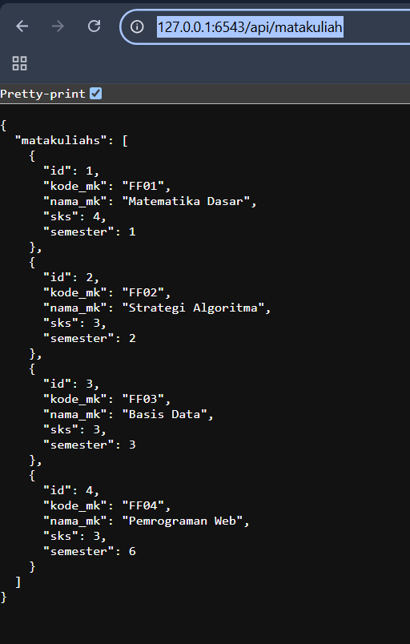
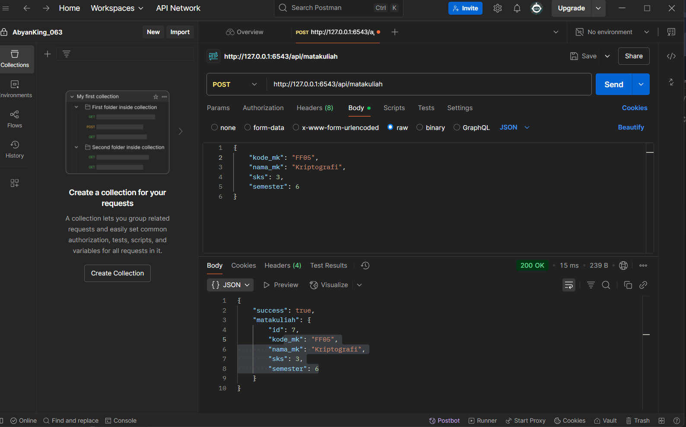
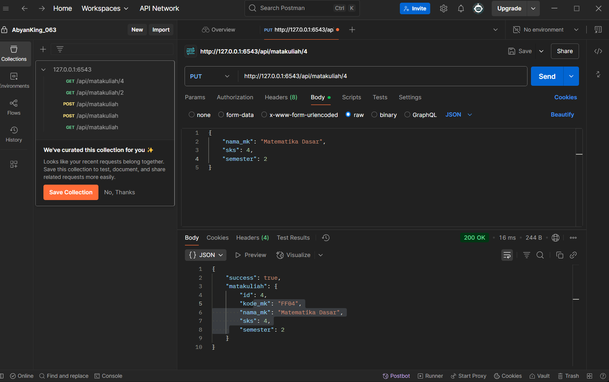
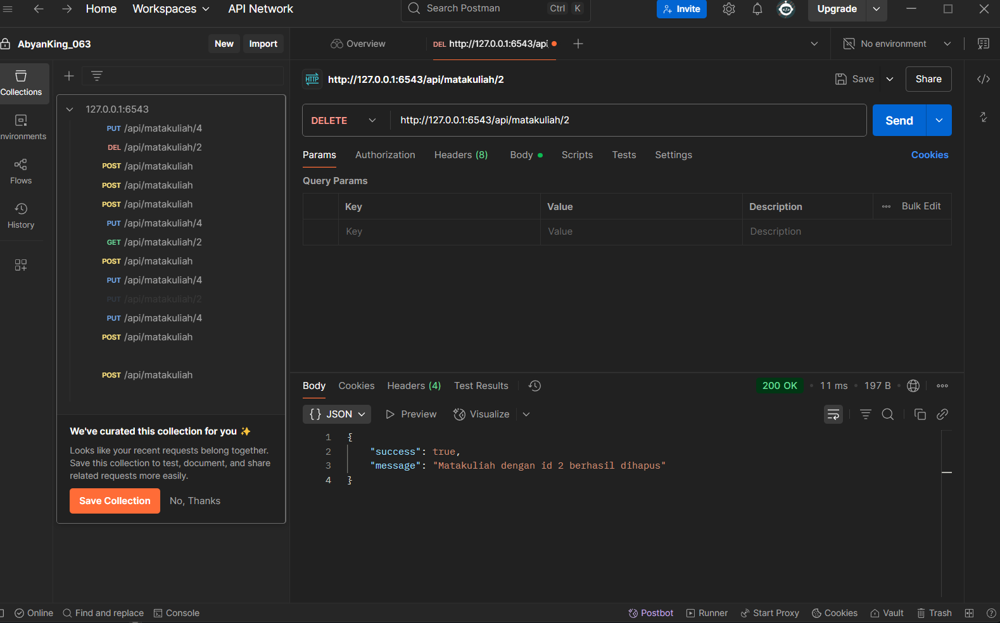

matakuliah
=================

Untuk Menjalankan
---------------

- Change directory into your newly created project.

    cd pyramid_mahasiswa

- Create a Python virtual environment.

    python -m venv env

- Upgrade packaging tools.

    pip install --upgrade pip setuptools

- Install the project in editable mode with its testing requirements.

    pip install -e ".[testing]"

- Initialize and upgrade the database using Alembic.

    - Generate your first revision.

        alembic -c development.ini revision --autogenerate -m "init"

    - Upgrade to that revision.

        alembic -c development.ini upgrade head

- Load default data into the database using a script.

    initialize_pyramid_mahasiswa_db development.ini

- Run your project's tests.

    pytest

- Run your project.

    pserve development.ini

## Screenshot Hasil

### Tampilan API semua

### Tampilan Get
_matakuliah.png)

### Tampilan Post

### Tampilan Put

### Tampilan Delete

